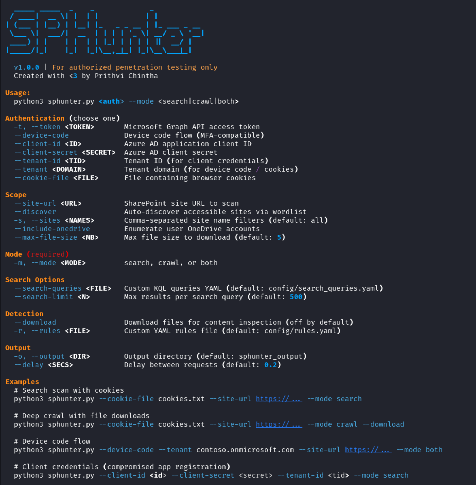

# SPHunter



SPHunter is a SharePoint Online reconnaissance tool that hunts for exposed credentials, secrets, PII, and sensitive configurations.

*For authorized security testing only.*

## Installation

```bash
git clone https://github.com/GheekyByt3/SPHunter.git
cd SPHunter
python3 -m venv venv
source venv/bin/activate
pip install -r requirements.txt
```

## Features

- **Three scan modes** — `search` (fast KQL queries), `crawl` (deep recursive walk), or `both` (combined, deduplicated)
- **52 pre-built search queries** — Comprehensive KQL queries covering credentials, keys, configs, PII, and more
- **Four auth methods** — Browser cookies, access tokens, device code flow (MFA-compatible), client credentials
- **Dual API support** — Microsoft Graph API and SharePoint REST API, with automatic fallback
- **Two-layer detection** — Filename pattern matching (28 rules) + content regex scanning (16 rules)
- **Content inspection** — Downloads and scans file contents for secrets, credentials, PII (opt-in with `--download`)
- **Automatic token refresh** — Silent token renewal for long-running scans
- **Customizable rules** — YAML-based detection rules and search queries, easy to extend
- **Rich reporting** — Interactive HTML, CSV, and JSON output
- **Rate limit handling** — Automatic throttling and retry on 429 responses
- **Live console output** — Color-coded findings as they're discovered

## Quick Start

### Option 1: Browser Cookies (easiest)

If you have browser access to the SharePoint site:

1. Open the target SharePoint site in your browser
2. Press F12 -> Network tab -> filter by `_api`
3. Run any fetch in Console tab to trigger a request
4. Click the request -> Headers -> copy the full `cookie:` value
5. Save it to a file: `cookies.txt`

```bash
python3 sphunter.py --cookie-file cookies.txt \
  --site-url "https://contoso.sharepoint.com/sites/IT" \
  --mode search
```

### Option 2: Device Code Flow (MFA-compatible)

```bash
python3 sphunter.py --device-code --tenant contoso.onmicrosoft.com \
  --site-url "https://contoso.sharepoint.com/sites/IT" \
  --mode crawl
```

Displays a code to enter at `microsoft.com/devicelogin`. The tool automatically tries multiple Microsoft first-party app IDs and scope combinations.

### Option 3: Access Token

If you have a Microsoft Graph or SharePoint REST API access token:

```bash
python3 sphunter.py --token "eyJ0eXAi..." \
  --site-url "https://contoso.sharepoint.com/sites/IT" \
  --mode both
```

**Two token types are accepted:**

| Token Type | Audience (`aud` claim) | Where to get it |
|------------|----------------------|-----------------|
| **Microsoft Graph token** | `https://graph.microsoft.com` | Browser dev tools → filter `graph.microsoft.com` requests → `Authorization` header |
| **SharePoint REST token** | `https://contoso.sharepoint.com` | Browser dev tools → filter `_api` requests → `Authorization` header |

To grab a token from the browser:
1. Open the target SharePoint site in your browser
2. Press F12 → Network tab
3. Filter by `graph.microsoft.com` (for a Graph token) or `_api` (for a SharePoint token)
4. Click any matching request → Headers → copy the `Authorization` value (strip the `Bearer ` prefix)
5. Pass just the JWT: `--token "eyJ0eXAi..."`

SPHunter auto-detects which type you provided and validates against the correct API. For SharePoint REST tokens, the tenant URL is extracted automatically from the token's `aud` claim. If that fails (uncommon), pass `--site-url` as a fallback so the tool knows which tenant to validate against.

### Option 4: Client Credentials

If you've compromised an Azure AD app registration with SharePoint permissions:

```bash
python3 sphunter.py --client-id <id> --client-secret <secret> --tenant-id <tid> \
  --mode both --output ./results
```

## Scan Modes

| Mode | What it does | Speed | Thoroughness |
|------|-------------|-------|--------------|
| `--mode search` | KQL queries against SharePoint Search API | Fast | Finds indexed files matching known patterns |
| `--mode crawl` | Recursive folder walk of every document library | Slower | Finds every accessible file, including unindexed |
| `--mode both` | Search + crawl combined, results deduplicated | Slowest | Most thorough — catches everything |

**Recommended workflow for engagements:**
1. Start with `--mode search` for a quick surface-level scan
2. Run `--mode crawl` on high-value sites for deep coverage
3. Use `--mode crawl --download` only when you need content inspection on specific sites

## Usage Options

```
Authentication (choose one):
  --token, -t        <TOKEN>     Microsoft Graph / SharePoint API access token
  --device-code                  Device code flow (MFA-compatible)
  --client-id        <ID>        Azure AD application client ID
  --client-secret    <SECRET>    Azure AD client secret
  --tenant-id        <TID>       Tenant ID (for client credentials)
  --tenant           <DOMAIN>    Tenant domain (for device code / cookies)
  --cookies          <STRING>    Browser cookies from SharePoint session
  --cookie-file      <FILE>      File containing browser cookies

Scope:
  --site-url         <URL>       Direct SharePoint site URL to scan
  --discover                     Auto-discover accessible sites via wordlist brute-force
  --sites, -s        <NAMES>     Comma-separated site name filters
  --include-onedrive             Enumerate user OneDrive accounts
  --max-file-size    <MB>        Max file size to download (default: 5)

Mode (required):
  --mode, -m         <MODE>      search, crawl, or both

  --search-queries   <FILE>      Custom KQL queries YAML
  --search-limit     <N>         Max results per search query (default: 500)

Detection:
  --download                     Download files for content inspection (off by default)
  --rules, -r        <FILE>      Custom detection rules YAML

Output:
  --output, -o       <DIR>       Output directory (default: ./sphunter_output)
  --delay            <SECS>      Delay between API requests (default: 0.2)
```

## Examples

```bash
# Fast search scan with cookies
python3 sphunter.py --cookie-file cookies.txt \
  --site-url "https://contoso.sharepoint.com/sites/IT" --mode search

# Deep crawl — every file, filename matching only (no downloads)
python3 sphunter.py --cookie-file cookies.txt \
  --site-url "https://contoso.sharepoint.com/sites/HR" --mode crawl

# Full scan with content inspection (downloads files — noisy!)
python3 sphunter.py --cookie-file cookies.txt \
  --site-url "https://contoso.sharepoint.com/sites/IT" --mode crawl --download

# Search + crawl combined
python3 sphunter.py --cookie-file cookies.txt \
  --site-url "https://contoso.sharepoint.com/sites/Finance" --mode both

# Device code flow with custom search queries
python3 sphunter.py --device-code --tenant contoso.onmicrosoft.com \
  --site-url "https://contoso.sharepoint.com/sites/IT" \
  --mode search --search-queries custom_queries.yaml

# Auto-discover all accessible sites and crawl them
python3 sphunter.py --cookie-file cookies.txt \
  --tenant contoso.onmicrosoft.com --discover --mode crawl
```

## Output

Each run creates a timestamped directory with:

| File | Description |
|------|-------------|
| `sphunter_report.html` | Interactive HTML report with sortable/filterable findings |
| `sphunter_findings.csv` | Findings-only CSV — one row per rule match, for Excel analysis |
| `sphunter_findings.json` | Machine-readable JSON with full metadata |
| `sphunter_all_files.csv` | Every discovered file regardless of findings — useful for manual review (crawl / both mode only) |
| `downloads/` | Downloaded files (only when `--download` is used) |

## Detection Rules

### Filename Rules (`config/rules.yaml`)
Match against file names using case-insensitive regex:
```yaml
filename_rules:
  - name: "KeePass Database"
    pattern: '.*\.(kdbx|kdb)$'
    severity: black
    description: "KeePass password database"
```

### Content Rules (`config/rules.yaml`)
Match against file contents (requires `--download`):
```yaml
content_rules:
  - name: "AWS Access Key"
    pattern: 'AKIA[0-9A-Z]{16}'
    severity: black
    description: "AWS Access Key ID"
```

### Search Queries (`config/search_queries.yaml`)
KQL queries for SharePoint Search API (used in `--mode search` and `--mode both`):
```yaml
queries:
  - name: "PowerShell Credential Scripts"
    kql: '(filetype:ps1) AND ("SecureString" OR "PSCredential")'
    severity: red
    description: "PowerShell scripts containing credential handling"
```

52 queries are included covering: password managers, private keys, web configs, remote access files, deployment images, CI/CD secrets, database connection strings (C#, Java, PHP, Python, Ruby), memory dumps, network captures, shell history, and more.

### Severity Levels (Snaffler-style)
- **Black** — Direct credential exposure (keys, passwords, tokens)
- **Red** — Sensitive data files (database backups, PII, secrets)
- **Yellow** — Potentially sensitive (scripts, configs, financial docs)
- **Green** — Informational (archives, internal IPs)

## Architecture

```
SPHunter Pipeline:

  Phase 1: AUTH
  ├── Cookies / Token / Device Code / Client Credentials
  └── Auto-selects Graph API or SharePoint REST API
          │
  Phase 1.5: DISCOVER (optional, --discover flag)
  ├── Brute-force 240 common site names (/sites/ + /teams/)
  └── Returns list of accessible sites to enumerate
          │
  Phase 2: ENUMERATE (skipped in search-only mode)
  ├── Discover document libraries per site
  └── Graph API → REST API fallback → direct --site-url
          │
  Phase 3a: SEARCH (search / both mode)
  ├── 52 KQL queries against SharePoint Search API
  └── Returns file metadata for indexed matches
          │
  Phase 3b: CRAWL (crawl / both mode)
  ├── Recursive folder walking via REST API
  ├── Downloads text files for content inspection (if --download)
  └── Returns every accessible file
          │
  DEDUPLICATE (both mode only)
          │
  Phase 4: DETECT
  ├── Layer 1: Filename pattern matching (28 rules)
  └── Layer 2: Content regex scanning (16 rules, requires --download)
          │
  Phase 5: REPORT
  ├── Interactive HTML with sort/filter
  ├── Findings CSV for Excel analysis
  ├── Discovered files CSV (crawl/both mode only)
  └── JSON for automation
```

## Project Structure

```
SPHunter/
├── sphunter.py                   # Entry point (python3 sphunter.py)
├── sphunter/
│   ├── __init__.py
│   ├── __main__.py              # Module entry point (python3 -m sphunter)
│   ├── cli.py                   # CLI argument parsing and orchestration
│   └── modules/
│       ├── auth.py              # Authentication (4 methods + token refresh)
│       ├── enumerator.py        # Graph API site/drive discovery
│       ├── sp_enumerator.py     # SharePoint REST API site/drive discovery
│       ├── crawler.py           # Graph API recursive file crawler
│       ├── sp_crawler.py        # SharePoint REST API recursive file crawler
│       ├── searcher.py          # KQL search query engine
│       ├── discovery.py         # Site brute-force discovery via wordlist
│       ├── detector.py          # Filename + content detection engine
│       └── reporter.py          # Report generation (HTML, CSV, JSON, all-files CSV)
├── config/
│   ├── rules.yaml               # Detection rules (28 filename + 16 content)
│   ├── search_queries.yaml      # KQL search queries (52 queries)
│   └── site_wordlist.txt        # 240 common site names for --discover
├── requirements.txt
├── setup.py
└── README.md
```

## Required Permissions

Depends on authentication method:

| Method | Permissions Needed |
|--------|-------------------|
| `--cookies` | Whatever the browser session has access to |
| `--device-code` | Delegated: `Sites.Read.All`, `Files.Read.All` (or `.default`) |
| `--token` | Depends on token scope |
| `--client-id/secret` | Application: `Sites.Read.All`, `Files.Read.All` |

## Operational Notes

- **Audit logging:** All API calls are logged in SharePoint/Azure AD audit logs. This is expected for authorized testing.
- **Downloads are noisy:** The `--download` flag triggers file download events visible in DLP/CASB. Use only when needed.
- **Cookie expiry:** Browser cookies expire. If scans fail mid-run, re-export fresh cookies.
- **Token refresh:** Automatic for device code and client credential flows. Direct tokens (`--token`) cannot be refreshed — scans over 60 minutes may fail.
- **Rate limiting:** The `--delay` flag controls request spacing. Increase for large environments.

## Credits

SPHunter was inspired by the work of [SnaffPoint](https://github.com/nheiniger/SnaffPoint) and [ShareFiltrator](https://github.com/Friends-Security/sharefiltrator), which pioneered using SharePoint's Search API to surface sensitive files during penetration tests. SPHunter builds on these ideas with recursive crawling, content inspection, four authentication methods, dual API support, and structured reporting.

## License

MIT License. For authorized security testing only. Use responsibly.
